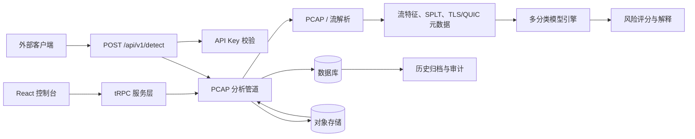

# 技术架构

## 1. 架构概览

平台采用 React + Express 的全栈结构。浏览器通过 tRPC 操作公共工作区中的数据集、模型、检测任务和历史记录；独立客户端通过带 API Key 的 HTTP 接口提交 PCAP。服务端完成报文解析、流特征工程、多分类评分、持久化和审计记录。

## 2. 核心处理链路

离线 PCAP 上传后被保存至对象存储。分析服务按照五元组和方向构建双向流，生成包数、字节数、持续时间、平均包长、包间隔、上下行比和 SPLT 序列；并在网络可见范围内提取 TLS 版本、JA3、SNI 可见性和 QUIC 长包头版本。模型引擎对选定特征进行标准化和多分类评分，最终形成类别概率、风险级别与特征偏离解释。

| 阶段 | 输入 | 输出 | 持久化实体 |
| --- | --- | --- | --- |
| 样本接入 | PCAP 与类别标签 | 上传/解析状态、协议统计 | `datasets`、`uploadTasks` |
| 特征提取 | 报文与流会话 | 双向流特征、SPLT、TLS/QUIC 元数据 | `flowFeatures` |
| 模型训练 | 已标注流特征 | 模型参数、类别集合、评估指标 | `modelVersions`、`trainingJobs` |
| 离线检测 | 待测 PCAP 与模型 | 任务摘要、逐流风险、类别概率与解释 | `detectionTasks`、`detectionFlows` |
| 审计归档 | 关键业务操作 | 操作摘要、实体关联与元数据 | `operationLogs` |

## 3. 模型与解释

系统支持 Logistic Regression 与 Gaussian Naive Bayes。训练结果保存模型类型、特征集、类别集合、标准化参数、权重/分布参数、训练数据集编号及 Accuracy、Precision、Recall、F1 等指标。检测结果保存每条流的预测类别、各类别概率、风险分值、解释原因和原始可见元数据，因此历史结果无需重新解析原始 PCAP 即可查看。

## 4. 数据与安全边界

文件实体保存于对象存储，结构化索引与分析结果保存于 MySQL/TiDB 兼容数据库。控制台使用公共工作区模式，适合内部受控环境；独立检测 API 采用 `x-api-key` 认证，数据库仅持久化密钥摘要。生产部署中应由上层网关实施网络访问控制、请求体上限、速率限制、审计保留期限和备份策略。

> ECH、TLS 1.3 与 QUIC 会限制被动网络侧可见字段。平台仅对可见的协议元数据建模；未观测到的 SNI、JA3 或版本字段会明确记录为 `UNKNOWN` 或 `not_observed`，不会伪造明文信息。
