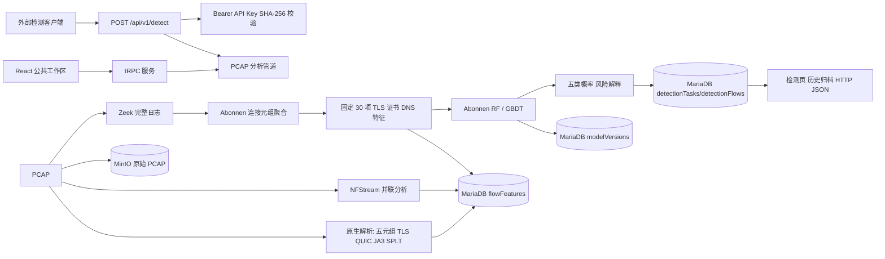

# 技术架构

## 架构概览

平台采用 React + Express/tRPC 全栈结构。浏览器通过公共工作区管理样本、标注、训练、模型、检测和历史归档；外部客户端通过 `POST /api/v1/detect` 提交 PCAP。模型核心严格基于 [Abonnen/Malicious_TLS_Detection](https://github.com/Abonnen/Malicious_TLS_Detection)：Zeek 生成连接、TLS、X.509 和 DNS 日志，连接元组聚合器构造上游定义的特征，随机森林或 GBDT 输出类别概率。[1]

## 核心处理链路

| 阶段 | 输入 | 输出 | 持久化实体 |
| --- | --- | --- | --- |
| 样本上传 | PCAP、标注类别、标注集 | 上传状态、包数、协议分布 | `uploadTasks`、`datasets`、MinIO |
| 特征提取 | PCAP | 上游 30 项特征、五元组、TLS/QUIC、JA3、SPLT、NFStream | `flowFeatures` |
| 模型训练 | 已标注的上游特征行 | 分类器工件、类别集、Accuracy/Precision/Recall/F1 | `trainingJobs`、`modelVersions` |
| 流量检测 | 待测 PCAP、已激活或指定模型 | 五类概率、风险分、特征解释、逐流详情 | `detectionTasks`、`detectionFlows` |
| 审计归档 | 上传、标注、训练、激活、API Key、检测操作 | 操作摘要与关联元数据 | `operationLogs` |

## 上游模型契约

| 层次 | 设计 | 不可变约束 |
| --- | --- | --- |
| 日志来源 | Zeek `conn.log`、`ssl.log`/`tls.log`、`x509.log`、`dns.log` | 生产检测特征以 Zeek 日志为主来源。 |
| 聚合单元 | `(orig_h, resp_h, resp_p, proto)` 连接元组 | 与上游 `ConnectionTuple` 的连接、TLS、证书和 DNS 聚合语义一致。 |
| 特征集 | 上游 `Dataset.py` 筛选的 30 个字段 | 训练、存储和推理使用同一顺序，不能删减或重排。 |
| 算法 | `abonnen_random_forest`、`abonnen_gbdt` | 保持上游随机森林和 GBDT 的关键参数；默认随机森林。 |
| 标签 | 正常、命令控制、数据外传、横向移动、恶意传输 | `predict_proba` 映射到固定五类；未见类别概率填 0。 |
| 风险评分 | `1 - P(benign)` | 不再与 KitNET 或其他异常检测器融合。 |

上游原始代码面向二分类。平台五分类仅扩展标签编码、分层验证、指标计算和概率列映射；不替换其 Zeek 特征语义、筛选特征或随机森林/GBDT 算法。[1]

## 数据与安全边界

原始 PCAP 保存于 MinIO；结构化索引、特征、模型、检测结果和审计日志保存于 MariaDB。`flowFeatures` 并存 `nfstreamJson` 与 `abonnenJson`，前者用于并联展示和溯源，后者是监督模型唯一输入。对象下载通过应用代理重定向到短期预签名 URL，避免向浏览器暴露 MinIO 凭据。

公共工作区固定使用 `trafficguard_public_workspace`，适合受控内部环境。独立 API 使用 `Authorization: Bearer <API_KEY>`；数据库仅保存 API Key 的 SHA-256 哈希。上传大小受限，部署时应通过防火墙或反向代理进一步实施来源控制、速率限制、TLS 终结、备份和审计保留策略。

> TLS 1.3、ECH 与 QUIC 会限制被动网络可见字段。平台只对可见的协议、握手、证书和流量元数据建模；未观测字段会显式记录为缺失或 `UNKNOWN`，不会伪造明文内容。

旧版 `lightgbm_kitnet`、逻辑回归和高斯朴素贝叶斯模型可在历史归档中查询，但不允许用于新检测推理。新版本只允许创建 `abonnen_random_forest` 或 `abonnen_gbdt`。

## 参考

[1] [Abonnen, *Malicious_TLS_Detection*](https://github.com/Abonnen/Malicious_TLS_Detection)。
